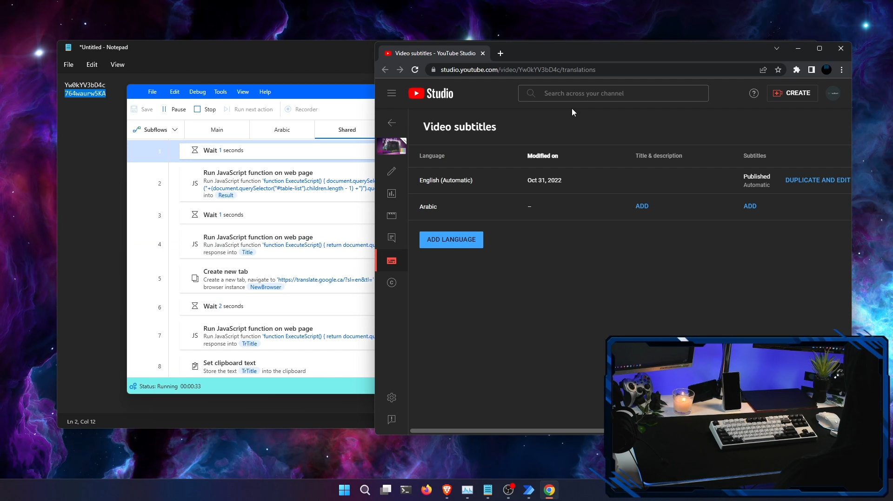

# Automatic Youtube Video Title and Description Translator

## Prerequisites

- Windows with Microsoft account
- Power Automate and browser extension
- Google Chrome or Microsoft Edge 
  - where your channel account is logged in
  - and where youtube is in english (else you will need to reconfigure some parts of the flow)

## How to use

Check youtube videos :
- Installation and usage: https://youtu.be/5OJXXrAIp-4
- Explanation:  

## Flow

- Main
    - start with entering the number of videos you want to translate
    - then enter their ids 
      - youtu.be/**Yw0kYV3bD4c**
    - Get back , relax and watch flow work in your place
    - The flow will then enter a loop whre for each video id will:
      - for each language will:
        - Open chrome to your video translations page in youtube studio
        - Add the specific language
        - Get the title
        - Open google translate in a new tab
        - Translate and save translated Title
        - Close google translate tab
        - get translated Title and past it to the translation box in youtube studio
        - Do the same thing for description